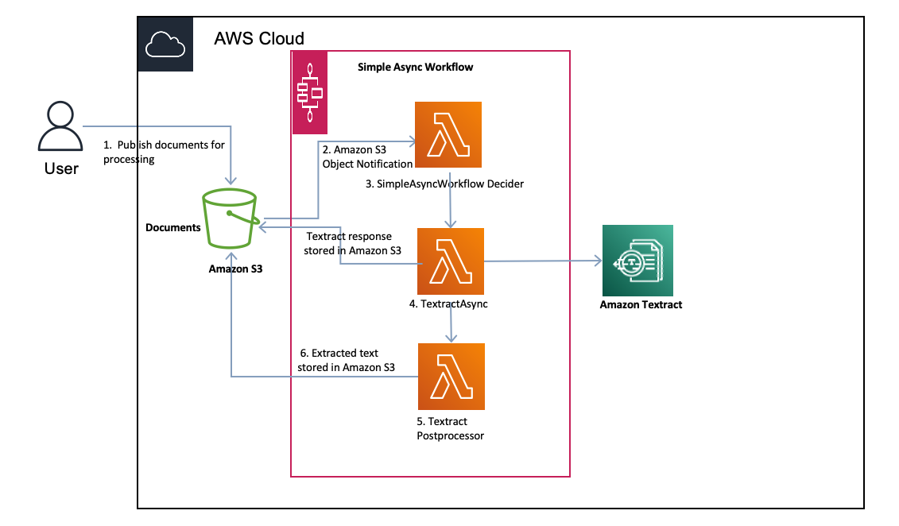

# Amazon Textract PDF Text Extractor

Improve data extraction and document processing with
Amazon Textract

This project provides a mechanism to use Amazon Textract to extract meaningful
actionable data from a wide range of complex multi-format PDF files. PDF files
are challenging, they can have a variety of data elements like headers, footers,
tables with data in multiple columns, images, graphs, sentences and paragraphs in
different formats. We explore the data extraction phase of IDP as shown in the
following figure, and how they connect to the steps involved in a document
process, such as ingestion, extraction and post processing.

# Solution Architecture

## Prerequisites

You can either use AWS Cloud9 or your local to deploy this solution.

## Prerequisites for local setup
1. Download and install the latest version of Python for your OS from [here](https://www.python.org/downloads/). We will be using Python 3.8+.

2. You will need to install version 2 of the [AWS CLI](https://docs.aws.amazon.com/cli/latest/userguide/cli-chap-install.html) as well. If you already have AWS CLI, please upgrade to a minimum version of 2.0.5 following the instructions on the link above.

3. AWS CDK

4. Docker

## Deployment Instructions

1. Clone this repo to your local or Cloud9.

2. Run the following commands:
   pip install -r requirements.txt

   cdk bootstrap

   cdk deploy SimpleAsyncWorkflow

## Execution Instructions

   Follow the instructions in blog [post](https://aws.amazon.com/blogs/machine-learning/improve-data-extraction-and-document-processing-with-amazon-textract/).

## Further Reading:

[IDP constructs](https://constructs.dev/packages/amazon-textract-idp-cdk-constructs/v/0.0.7/api/TextractGenericAsyncSfnTask?lang=typescript)

## License

   This library is licensed under the [MIT-0 License](https://github.com/aws/mit-0).
